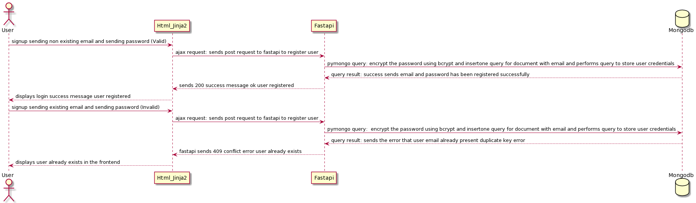
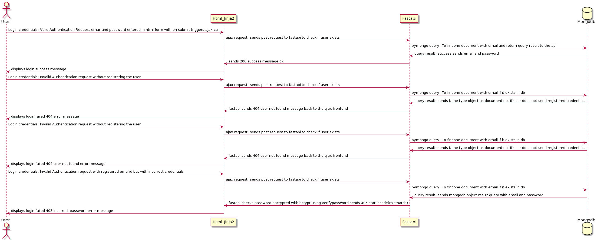
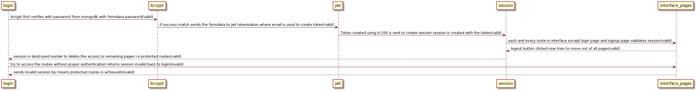
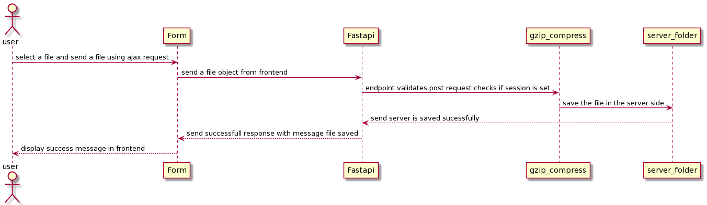
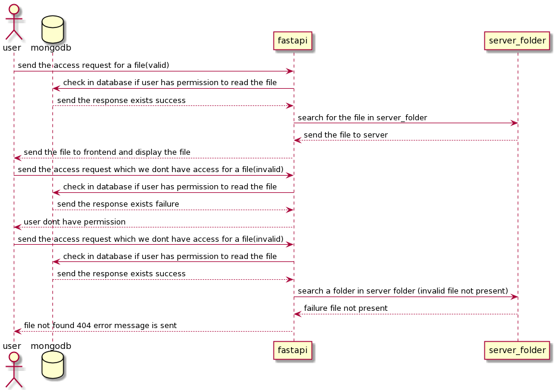

## Usage of package

<br>

Clone this repository
<br>

```
git clone https://github.com/sanjay-06/cloudwiry_hackathon_2022
```

Install the modules in the requirements.txt

```bash
pip install -r requirements.txt
```
## start the project

```bash
 uvicorn main:app --reload
```


### The sequence diagram for Signup function in the blob server
<hr>
<br>



### The sequence diagram for login function in the blob server
<hr>
<br>




<br>

### The sequence diagram for user authentication in the blob server
<hr>
<br>




<br>

### The sequence diagram for upload file in the blob server
<hr>
<br>




<br>

### The sequence diagram for permission update during upload in the blob server
<hr>
<br>


### The sequence diagram for sending files if user have access
<hr>
<br>




### The starting page of the project is given by as screenshot
<hr>
<br>

```
Login Page of the interface
```


```
Signup Page of the interface
```

