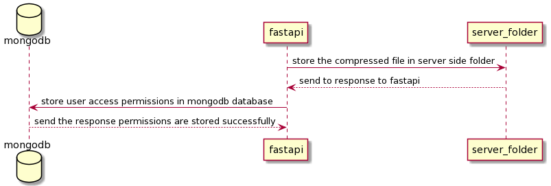

# Blob Server

The link for the project deployed in Microsoft Asure cloud is given by:

## <a href="http://20.185.234.212:8000/">click here for Demo</a>


The deployments specified in the github are actually just testing deployment for frontend the actual deployment is done by the above link in Microsoft Azure cloud service platform
<br>

## Video demo
<hr>

<a link="https://drive.google.com/file/d/1lz30E6yBoJuhEqPrC0y1hnbyPMZMkryv/view?usp=sharing">
click here for Interface demo </a>

<a link="https://drive.google.com/file/d/17m-heB4kAG_L02Vzbq26mrbkStjQP34U/view?usp=sharing">click here for Code walkthrough</a>

## Usage of package

<br>

Clone this repository
<br>

```
git clone https://github.com/sanjay-06/cloudwiry_hackathon_2022
```

Install the modules in the requirements.txt

```bash
pip install -r requirements.txt
```
## start the project

```bash
python main.py
```


### The sequence diagram for Signup function in the blob server
<hr>
<br>


### The sequence diagram for login function in the blob server
<hr>
<br>


<br>

### The sequence diagram for user authentication in the blob server
<hr>
<br>


<br>

### The sequence diagram for upload file in the blob server
<hr>
<br>


<br>

### The sequence diagram for permission update during upload in the blob server
<hr>
<br>





### The sequence diagram for sending files if user have access
<hr>
<br>


<hr>

